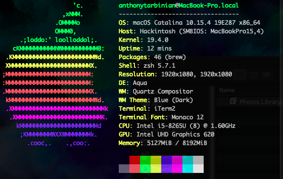

## Lenovo Ideapad Flex 14
### OpenCore 0.6.0 
#### macOS Catalina 10.15.4

|Feature|Working/Not Working|
| :------------- | :----------: |
| USB Ports (USB 3) |  ✓ |
| Internal Webcam | ✓ |
| Internal Microphone | ✓ |
| Internal Speakers | ✓ |
| Fingerprint Sensor | ✕ |
| HDMI port  | ✓ |
| HDMI Audio | ✕ |
| Bluetooth  | ✓ * |
| Internal Wifi  | ✕ |
| USB Wifi Adapter | ✓ |
| iMessage/FaceTime | ✓ |
| Boot Chime Audio  | ✕ |
| Backlight Keys  | ✓ |

**Issue when the computer is put to sleep*

### BIOS Configuration

Enter advanced BIOS mode and disable CFG-lock.  \
Credit to [daliansky](https://github.com/daliansky/Lenovo-Air13-IWL-Hackintosh/blob/master/Advanced/ReadMe.md)

